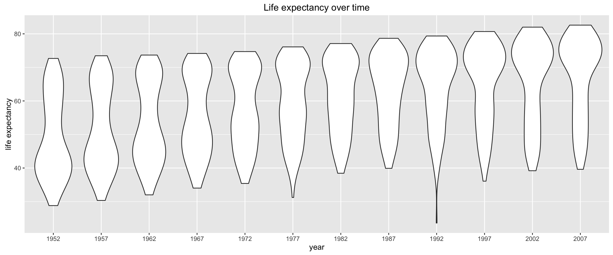

# Project 3

Due: July 3, 2019

## Part 1: Regression analysis of Gapminder data

In this part of this project you will practice and experiment with linear regression using data from <a href="http://gapminder.org">gapminder.org</a>. We recommend spending a little time looking at material there, it is quite an informative site.

We will use a subset of data provided by gapminder provided by <a href="http://www.stat.ubc.ca/~jenny/">Jennifer Bryan</a> described in it’s <a href="https://github.com/jennybc/gapminder">github page</a>.

Get the data from: https://github.com/jennybc/gapminder/blob/master/data-raw/08_gap-every-five-years.tsv

```
import pandas as pd
data = pd.read_csv("gap.tsv", sep='\t')
data.head()
```

```
## # A tibble: 6 × 6
##       country continent  year lifeExp      pop gdpPercap
##        <fctr>    <fctr> <int>   <dbl>    <int>     <dbl>
## 1 Afghanistan      Asia  1952  28.801  8425333  779.4453
## 2 Afghanistan      Asia  1957  30.332  9240934  820.8530
## 3 Afghanistan      Asia  1962  31.997 10267083  853.1007
## 4 Afghanistan      Asia  1967  34.020 11537966  836.1971
## 5 Afghanistan      Asia  1972  36.088 13079460  739.9811
## 6 Afghanistan      Asia  1977  38.438 14880372  786.1134
```

For this exercise you will explore how life expectancy has changed over 50 years across the world, and how economic measures like gross domestic product (GDP) are related to it.

**Exercise 1**: *Make a scatter plot of life expectancy across time.*

**Question 1**: *Is there a general trend (e.g., increasing or decreasing) for life expectancy across time? Is this trend linear? (answering this qualitatively from the plot, you will do a statistical analysis of this question shortly)*

A slightly different way of making the same plot is looking at the distribution of life expectancy across countries as it changes over time:

```
lggplot(aes(x='year', y='lifeExp'), data=data) +\
    geom_violin() +\
    labs(title="Life expectancy over time",
         x = "year",
         y = "life expectancy")</code></pre>
```



This type of plot is called a <em>violin plot</em>, and it displays the distribution of the variable in the y-axis for each value of the variable in the x-axis. You can create a violin plot using seaborn library.

**Question 2**: <em>How would you describe the distribution of life expectancy across countries for individual years? Is it skewed, or not? Unimodal or not? Symmetric around it’s center?</em>

Based on this plot, consider the following questions.

**Question 3**: <em>Suppose I fit a linear regression model of life expectancy vs. year (treating it as a continuous variable), and test for a relationship between year and life expectancy, will you reject the null hypothesis of no relationship? (do this without fitting the model yet. I am testing your intuition.)</em>

**Question 4**: <em>What would a violin plot of residuals from the linear model in Question 3 vs. year look like? (Again, don’t do the analysis yet, answer this intuitively)</em>. 

**Question 5**: <em>According to the assumptions of the linear regression model, what <strong>should</strong> that violin plot look like?</em>

**Exercise 2**: <em>Fit a linear regression model using, e.g., the `LinearRegression` function from Scikit-Learn or the closed-form solution we derived in class, for life expectancy vs. year (as a continuous variable). </em>

**Question 6**: <em>On average, by how much does life expectancy increase every year around the world?</em>

**Question 7**: <em>Do you reject the null hypothesis of no relationship between year and life expectancy? Why?</em>

**Exercise 3**: <em>Make a violin plot of residuals vs. year for the linear model from Exercise 2.</em>

**Question 8**: <em>Does the plot of Exercise 3 match your expectations (as you answered Question 4)?</em>

**Exercise 4**: <em>Make a boxplot (or violin plot) of model residuals vs. continent.</em>

**Question 9**: <em>Is there a dependence between model residual and continent? If so, what would that suggest when performing a regression analysis of life expectancy across time?</em>

**Exercise 5**: <em>As in the Moneyball project, make a scatter plot of life expectancy vs. year, grouped by continent, and add a regression line.</em>

**Question 10**: <em>Based on this plot, should your regression model include an interaction term for continent <strong>and</strong> year? Why?</em>

**Exercise 6**: <em>Fit a linear regression model for life expectancy including a term for an interaction between continent and year.</em>You may import statsmodel.formula.api to run ordinary least squares for this. 

**Question 11**: <em>Are all parameters in the model significantly different from zero? If not, which are not significantly different from zero?</em>

**Question 12**: <em>On average, by how much does life expectancy increase each year for each continent? (Provide code to answer this question by extracting relevant estimates from model fit)</em>

**Exercise 7**: <em> Perform an F-test that compares how well two models fit your data: (a) the linear regression models from Exercise 2 (only including year as a covariate) and (b) Exercise 6 (including interaction between year and continent).</em>
The F-test is obtained by calling fvalue from the results of exercises 2 and 6.

**Question 13**: <em>Is the interaction model significantly better than the year-only model? Why?</em>

**Exercise 8**: <em>Make a residuals vs. year violin plot for the interaction model. Comment on how well it matches assumptions of the linear regression model. Do the same for a residuals vs. fitted values model.</em>

## Submission

Prepare a Jupyter notebook that includes for each Problem: (a) code to carry out the step discussed, (b) output showing the result of your code, and (c) a short prose description of how your code works. Remember, the writeup you are preparing is intended to communicate your analysis effectively. Thoughtlessly showing large amounts of output in your writeup defeats that purpose.

All axes in plots should be labeled in an informative manner. Your answers to any question that refers to a plot should include both (a) a text description of your plot, and (b) a sentence or two of interpretation as it relates to the question asked.

Submit to ELMS at Project 3 Assignment Submission and a .pdf to Gradescope.

## Group work

You are encouraged to work in small groups, but you must prepare your own writeup and submit it. Include the names of the peers who you worked with in the writeup.

